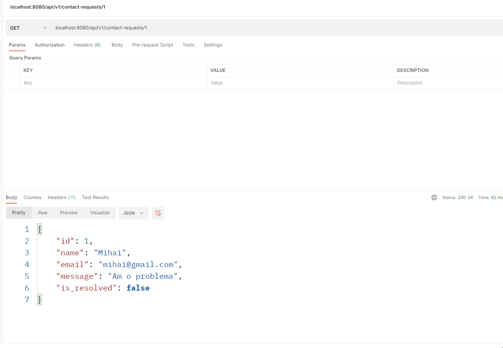
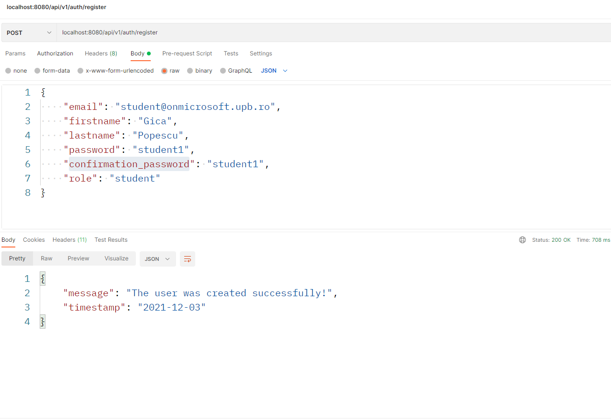
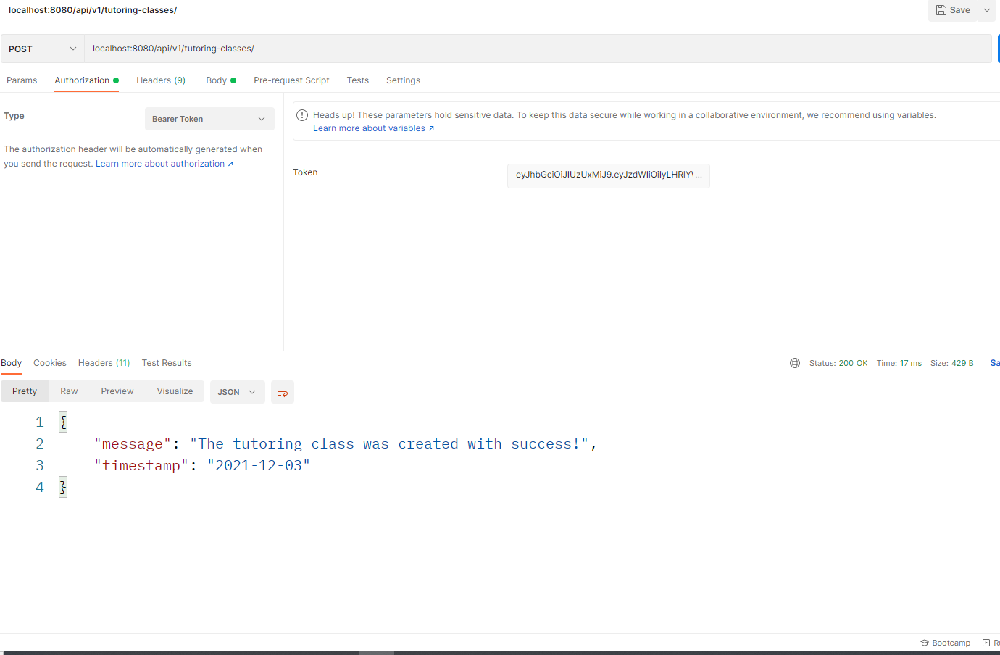
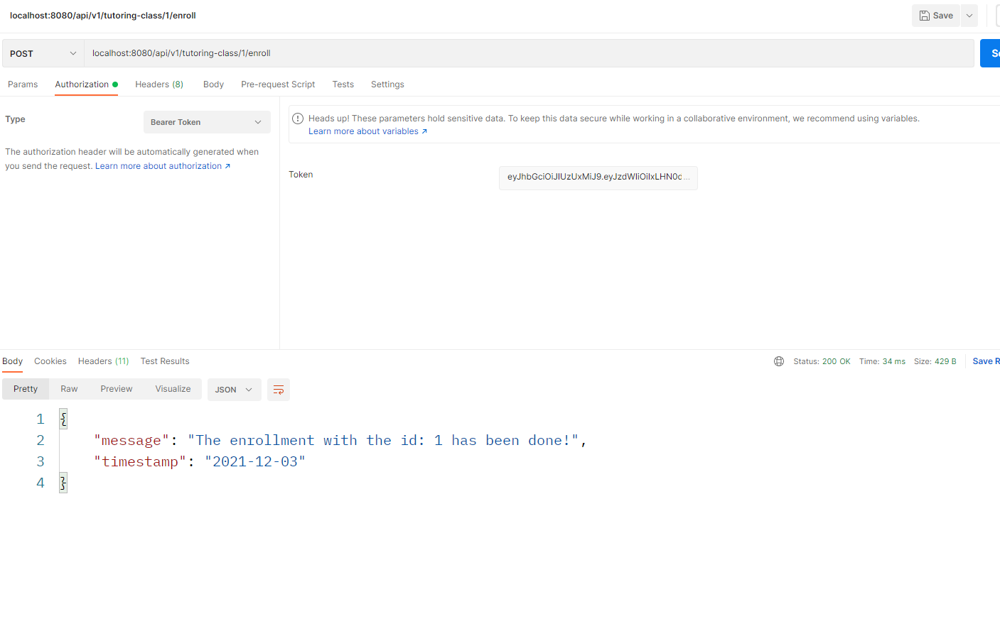
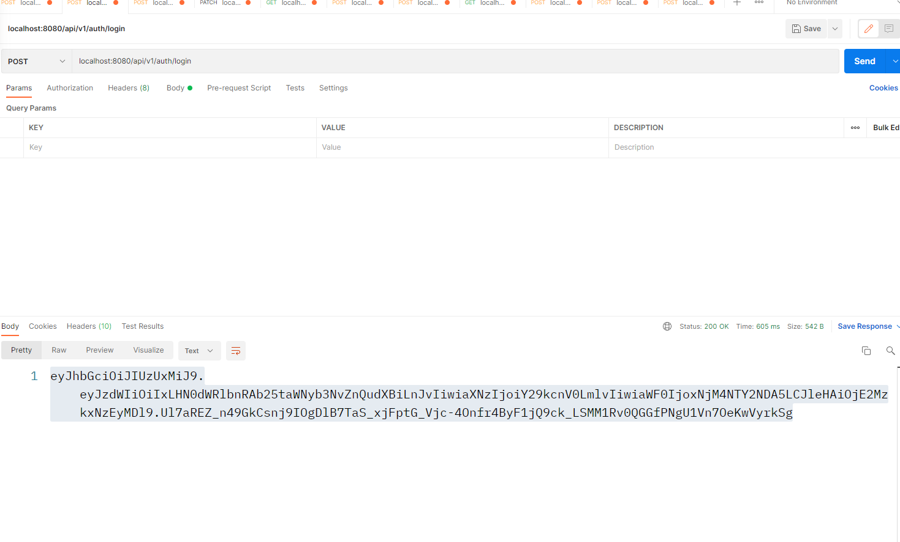

## PROBA DEPARTAMENT DE IT

Pentru proba de It am ales **Backend**-ul

Requirements:
- 
- **gradle** (https://gradle.org/install/)
- Puteti si sa importati proiectul in **Intellij**

Rulare
-
- pentru a rula proiectul cu gradle: 'gradle bootJar'

Descriere
- 
Proiectul a fost realizat folosind framework-ul Spring si are in spate sistemul de baze de date H2.
Am incercat sa imi fac un container de docker, dar partialul la analiza nu m-a lasat =)).

Am reusit sa implementez toate entitatile si endpoint-urile cerute, dar si anumite task-uri bonus.
In principal majoritatea endpoint-urilor executa operatii CRUD. 
Cateva elemente mai complicat de implementat au fost: autenetificarea de la punctul 2 si entitatea enrollment.
Aplicatia a fost destul de straight forward, dar am avut cateva mici blocaje de atentie si de organizare.

Screenshots
-

